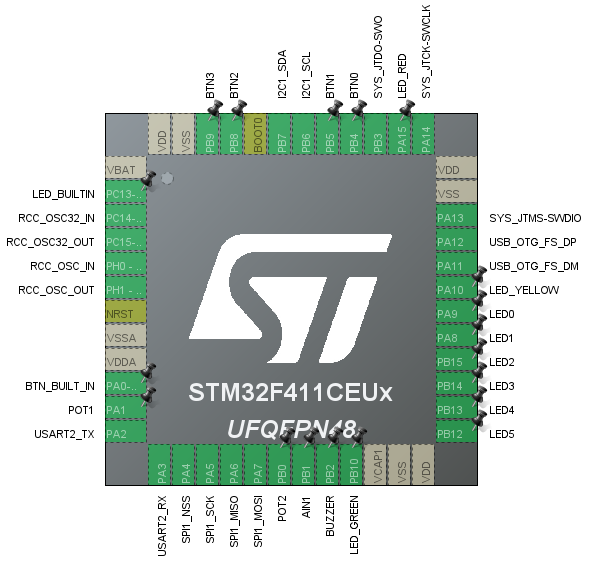

# Helloworld STM32F411CEU6 Project

This project is a basic example using the STM32F411CEU6 development board to demonstrate two functionalities:

1. **UART Communication**: Transmits the message "Apa kabar" every 500ms via UART2.
2. **LED Toggling**: Toggles LED1 every 500ms.

## Hardware Configuration

- **Development Board**: STM32F411CEU6
- **UART Port**: UART2
- **LED1**: Toggled every 500ms
- **Message**: Sent via UART2 - "Apa kabar"

### Pin Configuration

The following GPIO pins are configured for LEDs, buttons, potentiometers, and other components:



| **Pin Name**       | **Port** | **Description**       |
| ------------------ | -------- | --------------------- |
| `LED_BUILTIN_Pin`  | `PC13`   | On-board LED          |
| `BTN_BUILT_IN_Pin` | `PA0`    | On-board button       |
| `POT1_Pin`         | `PA1`    | Potentiometer 1       |
| `POT2_Pin`         | `PB0`    | Potentiometer 2       |
| `AIN1_Pin`         | `PB1`    | Analog Input 1        |
| `BUZZER_Pin`       | `PB2`    | Buzzer                |
| `LED_GREEN_Pin`    | `PB10`   | External LED (Green)  |
| `LED5_Pin`         | `PB12`   | External LED 5        |
| `LED4_Pin`         | `PB13`   | External LED 4        |
| `LED3_Pin`         | `PB14`   | External LED 3        |
| `LED2_Pin`         | `PB15`   | External LED 2        |
| `LED1_Pin`         | `PA8`    | External LED 1        |
| `LED0_Pin`         | `PA9`    | External LED 0        |
| `LED_YELLOW_Pin`   | `PA10`   | External LED (Yellow) |
| `LED_RED_Pin`      | `PA15`   | External LED (Red)    |
| `BTN0_Pin`         | `PB4`    | External Button 0     |
| `BTN1_Pin`         | `PB5`    | External Button 1     |
| `BTN2_Pin`         | `PB8`    | External Button 2     |
| `BTN3_Pin`         | `PB9`    | External Button 3     |

## Software Requirements

- **STM32CubeIDE**: Development environment used for building and flashing the firmware.
- **HAL Libraries**: Used for controlling GPIO, UART, and other peripherals.

## UART Communication

The code transmits the string `"Apa kabar \n\r"` through UART2 at regular intervals (500ms). To receive this message, connect the board's UART2 pins to a serial terminal.

## GPIO Control

- **LED1** (`PA8`) toggles its state every 500ms using the `HAL_GPIO_TogglePin()` function.

## Getting Started

1. Clone this repository:
   
   ```bash
   git clone https://github.com/yourusername/OLED_testV1.git
   ```

### 


